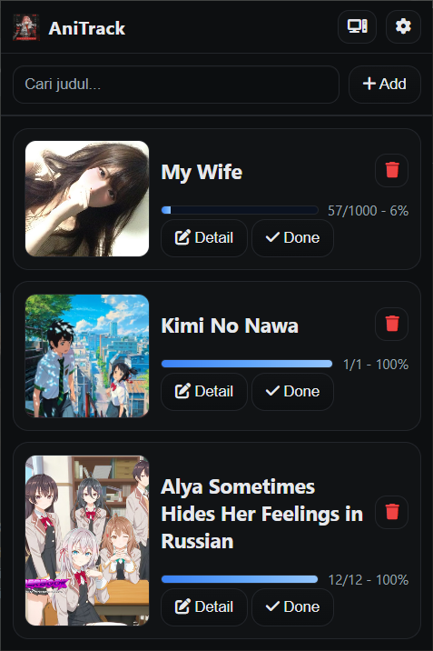
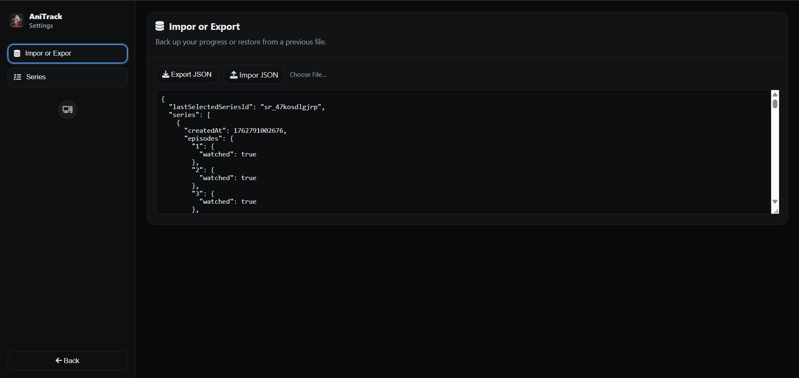
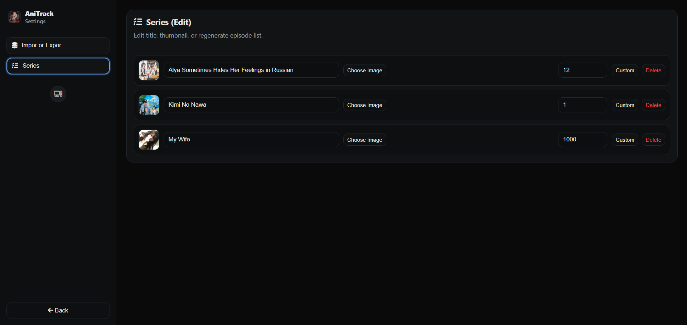

# 🧭 AniTrack

**AniTrack** is a lightweight Chrome Extension for tracking your anime watch progress - manually, locally, and beautifully.  
It focuses on **simplicity, dark neon aesthetics, and cloud sync** using Chrome Storage.

---

## ✨ Features

### 🎬 Series Management
- Add anime manually through the popup UI (title + thumbnail support).  
- Define total or custom episode counts easily.
- Mark episodes as watched/unwatched with instant progress tracking.
- Edit titles, update thumbnails, and regenerate episode lists via the Settings panel.

### ☁️ Import / Export JSON
- Export your data to a `.json` file for backup.
- Re-import anytime to restore your series list.
- All data is automatically synced across devices using `chrome.storage.sync`.

### ⚙️ Settings Panel
- Side navigation with a clean **admin-style dashboard**.
- Organized sections for Import/Export, Series, and Theme.
- Supports both light and dark modes, matching the popup theme.

### 🎨 Themes & UI
- Three theme modes: **System / Light / Dark**
- Smooth glowing neon design
- Minimalist cards, toggles, and responsive layouts for 380–560px wide popups.

### 🧩 Other Highlights
- Smart thumbnail caching with `chrome.storage.local` (prevents quota issues).
- Custom episode list parser (e.g., `1-12,24,100-110`).
- Modern Manifest V3 structure.
- 100% client-side - no external API calls.

---

## 📁 Project Structure

```
AniTrack/
├── manifest.json
├── background.js
├── common.js
├── popup.html
├── popup.js
├── popup.css
├── options.html
├── options.js
├── options.css
├── options_boot.js
├── theme.js
└── icons/
    ├── icon16.png
    ├── icon48.png
    └── icon128.png
```

---

## ⚙️ Installation (Manual / Developer Mode)

1. Clone or download this repository.
2. Open **chrome://extensions/**
3. Enable **Developer Mode** (top right corner).
4. Click **Load unpacked** and select the project folder.
5. The AniTrack icon will appear in your Chrome toolbar.

---

## 💾 Usage

### 1. Add New Series
- Click the extension icon → `+ Add`
- Enter the **title** and select a thumbnail image.
- Define the total number of episodes.

### 2. Track Progress
- Open a series and tick the checkboxes to mark episodes as watched.
- Progress bars update automatically.

### 3. Edit / Delete Series
- Open **Settings (⚙️)** in the popup.
- Navigate to **Series** → edit or delete entries.

### 4. Backup / Restore
- Use the **Import / Export** section in Settings.
  - 💾 Export: Save your anime list as JSON.
  - 📂 Import: Restore your list anytime.

---

## 🧩 Tech Stack
- **Chrome Manifest V3**
- **JavaScript (ES Modules)**
- **HTML5 + CSS3 (Neon-Dark theme)**
- **Font Awesome Icons v6**
- **chrome.storage.sync / local** for persistent data

---

## 🪄 Screenshots

<div align="center">

### 📦 Popup Panel


### ⚙️ Settings Panel


### 🧭 Series Management


</div>

---


## 📜 License
MIT License © 2025 Aether Studio
